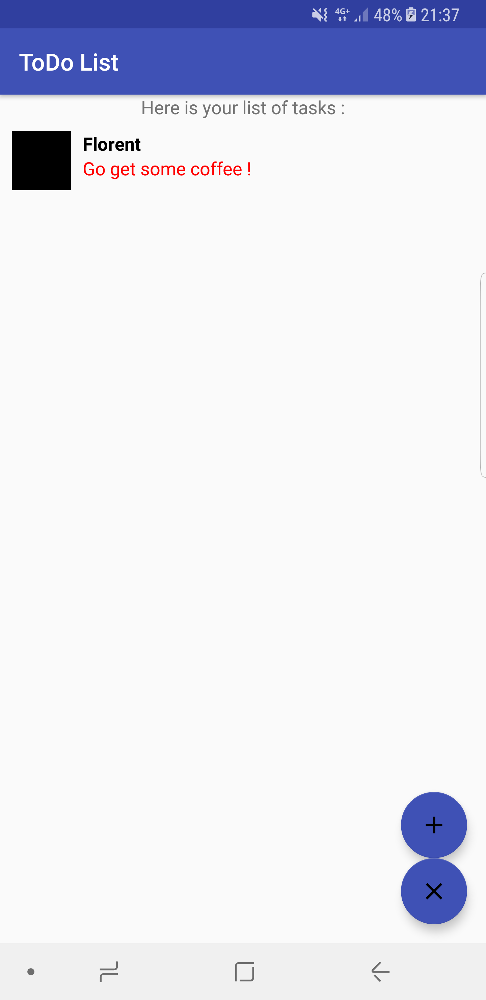
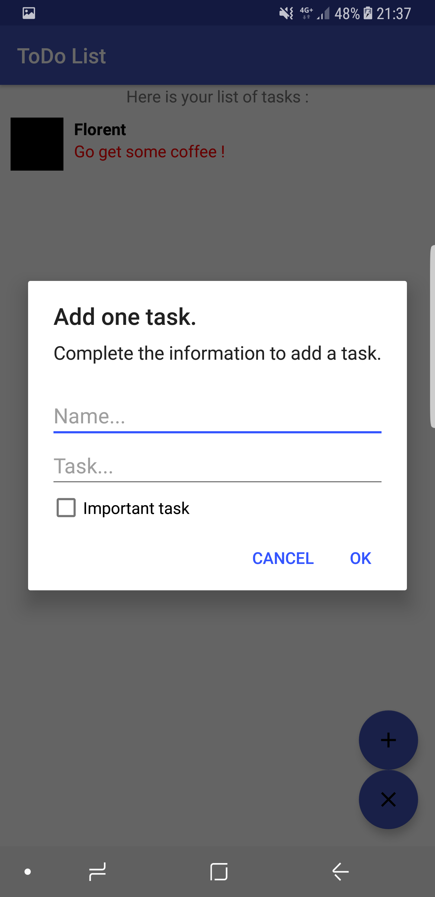
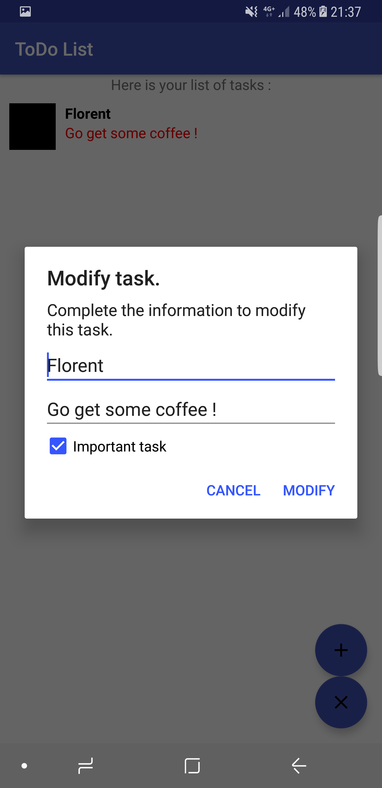

# ToDo List - Android
> This application makes it easy to manage your task list on Android phones & tablets.

[![License][license-image]][license-url]

This application allows you to add important or non-important tasks to your task list.
With a click on one of your tasks, you can mark it as finished or modify it at your convenience !

You can also mark as "Finished" the whole of your list of tasks and thus empty your list.

This application not requires a network connection to work.

    

## Features

- [x] Simple ToDo List (with important tasks or not).
- [x] Simple press to modify a task.
- [x] Long press to delete a task.
- [x] Ready to Publish.
- [x] 2 languages : English & French.

## Requirements

- Android Studio 3.1+
- Android 4.4+

## Usage

If you just want to install this application on your device, follow this instructions.

1. Download the .APK on this link : 
`https://github.com/WestFR/ToDoList-Android/tree/master/app-build-debug/app-debug.apk`

2. Install this .APK on your device

3. Enjoy and put a star !

## Installation (for developers)

1. Clone this project in your project folder : `git clone https://github.com/WestFR/ToDoList-Android`

2. Open this project thank your Android Studio and make one `Build Gradle Sync`

3. Enjoy (and develop your specific function)

## Contribute

We would love you for the contribution to ToDoList-Android, check the ``LICENSE`` file for more info.

## Meta

Distributed under the MIT license. See ``LICENSE`` for more information.

[license-image]: https://img.shields.io/badge/License-MIT-blue.svg
[license-url]: LICENSE
